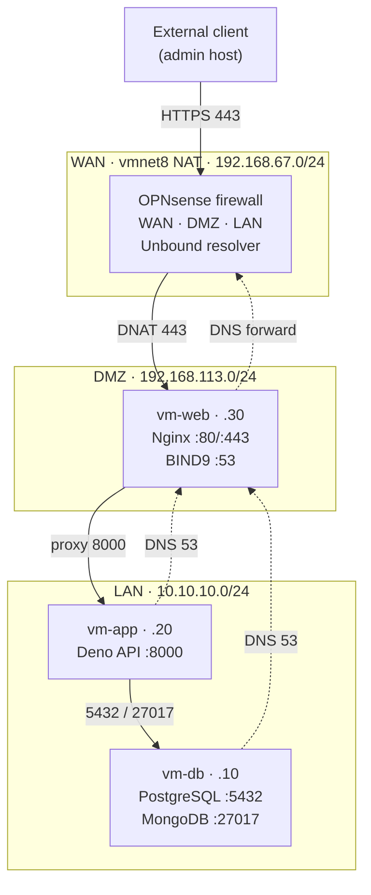

# Architecture

## Current stack

Two deployment modes share the same application code:

- **dev-local** — the whole stack on a single Docker host, for development and CI. See [`infra/dev-local/`](../infra/dev-local/).
- **Phase 7 lab** — the stack segmented across three Ubuntu Server VMs behind an OPNsense firewall (DMZ + LAN). This is the production-like deployment.

### Phase 7 network topology



Solid arrows are application traffic; dashed arrows are DNS. The only externally reachable port is 443 (DNATed to Nginx on vm-web). DMZ → LAN is restricted to the API port; LAN → DMZ is restricted to DNS. The full flow matrix and the verification scans are in [`infra/opnsense/RULES.md`](../infra/opnsense/RULES.md) and [`infra/opnsense/NMAP.md`](../infra/opnsense/NMAP.md).

Earlier phases built up to this topology: TLS termination (Phase 4), L7 rate limiting (Phase 5), internal DNS (Phase 6) and full segmentation across DMZ and LAN behind OPNsense (Phase 7). See [ROADMAP](ROADMAP.md).

## Why two databases?

The Erasmus+ curriculum required a comparative study of relational vs document models, and the project kept both as a practical demonstration:

- **PostgreSQL** holds a normalised relational schema (`trees`, `species`, neighborhoods). It exposes standard CRUD + SQL-based aggregations.
- **MongoDB** stores the raw GeoJSON features from the Cologne WFS, with a `2dsphere` index enabling native geospatial queries (`$geoNear`, radius search).

Both databases are populated from the same source dataset, via independent import scripts.

## Runtime

- **Deno 2.7.12** pinned in `app/Dockerfile` (alpine variant).
- **Hono** as the web framework.
- `deno-postgres` for PostgreSQL, official `mongodb` driver for Mongo.
- Minimal runtime permissions: `--cached-only --allow-net --allow-env --allow-read=.`.
- Container runs as non-root (`USER deno`, UID 1993).

## Repository layout

```
Cologne-Datahub/
├── app/                    # Application code
│   ├── src/
│   │   ├── main.ts
│   │   ├── db.ts           # PostgreSQL client
│   │   ├── mongo_db.ts     # MongoDB client
│   │   ├── lib/            # env validation, error helpers
│   │   ├── middleware/     # auth, request logger
│   │   └── routes/         # arboles.ts, arboles_mongo.ts, health.ts
│   ├── queries/            # schema.sql + reference queries
│   ├── scripts/            # fetch_data.ts, import_pg.ts, import_mongo.ts
│   ├── docs/               # openapi.json + swagger.html
│   ├── tests/              # 14 integration tests + helpers
│   ├── Dockerfile
│   └── deno.json
├── docs/                   # User-facing documentation
├── docs-tfc/
│   ├── DIARY.md            # Erasmus+ journal
│   └── adr/                # Architecture Decision Records (0001–0009)
├── infra/
│   ├── dev-local/          # single-host stack (compose + bind9 + nginx + certs)
│   ├── vm-web/             # DMZ host: bind9 + nginx + certs + compose
│   ├── vm-app/             # LAN host: Deno API compose
│   ├── vm-db/              # LAN host: Postgres + Mongo compose
│   ├── opnsense/           # firewall posture: RULES.md + NMAP.md
│   └── docker-compose.test.yml
├── .github/workflows/ci.yml
├── CHANGELOG.md
└── README.md
```

## Seeding real data

The default stack starts with empty databases. To populate them from the Cologne tree registry WFS:

```bash
# 1. Fetch the dataset (~58 MB of GeoJSON) into app/data/
docker run --rm -v "$PWD/app:/app" -w /app \
  --entrypoint deno denoland/deno:alpine-2.7.12 \
  run --allow-net --allow-write scripts/fetch_data.ts

# 2. Import into both databases (profile-gated services)
docker compose -f infra/dev-local/docker-compose.yml --env-file .env \
  --profile import run --rm import-pg

docker compose -f infra/dev-local/docker-compose.yml --env-file .env \
  --profile import run --rm import-mongo
```

The Mongo import script creates the `2dsphere` index automatically.

## Tests

The integration suite lives in `app/tests/` and runs against real ephemeral databases — no mocks. The ephemeral stack is separate from the main one to avoid conflicts:

- Main stack: Postgres `5432`, Mongo `27017`, app behind Nginx on `80`.
- Test stack: Postgres `5433`, Mongo `27018`, `tmpfs`-backed for speed.

```bash
# Start the ephemeral databases
docker compose -f infra/docker-compose.test.yml up -d --wait

# Run the tests
docker run --rm --network host -v "$PWD/app:/app" -w /app \
  --entrypoint deno denoland/deno:alpine-2.7.12 \
  test --allow-net --allow-env --allow-read

# Tear down
docker compose -f infra/docker-compose.test.yml down -v
```

The suite uses three deterministic fixture trees: a linden in Lindenthal, a monumental oak next to the Cathedral, and a maple in Altstadt-Süd.

## Observability

- **Structured JSON logs** in both Nginx and the application, correlated via `X-Request-ID`.
- **Health endpoints** at two levels: `/nginx-health` (edge), `/health` and `/health/ready` (application).
- **Docker healthchecks** on all four services. Readiness gating between services uses `depends_on: { condition: service_healthy }`.

A Python stdlib-only monitoring daemon is planned for Phase 9.
